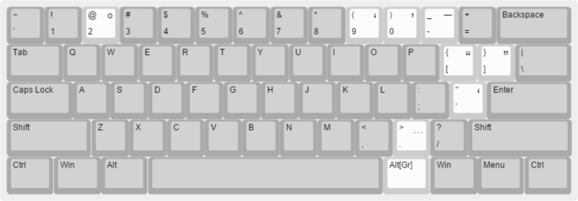

## The “US - Brian” Windows Keyboard Layout

### Key Mappings

| Key Combo | Character | Unicode | HTML Entity | Description          |
|-----------|-----------|---------|-------------|----------------------|
| AltGr+'   |     ʻ     | U+02BB  |             | The Hawaiian ʻokina  |
| AltGr+[   |     “     | U+201C  | `&ldquo;`   | Left Double Quote    |
| AltGr+]   |     ”     | U+201D  | `&rdquo;`   | Right Double Quote   |
| AltGr+9   |     ‘     | U+2018  | `&lsquo;`   | Left Single Quote    |
| AltGr+0   |     ’     | U+2019  | `&rsquo;`   | Right Single Quote   |
| AltGr+-   |     —     | U+2014  | `&mdash;`   | Em dash              |
| AltGr+2   |     °     | U+00B0  | `&deg;`     | Degree symbol        |
| AltGr+.   |     …     | U+2026  | `&hellip;`  | Horizontal ellipsis  |

“AltGr” refers to either “Ctrl + Alt” or “Right Alt” in this layout.

### Motivation

I frequently write Hawaiian words like Hawaiʻi and Oʻahu, and I want to be able
to easily type them without omitting the ʻokina in each word. Windows (as of
Windows 8) has a Hawaiian keyboard layout, but that layout turns the apostrophe
key into the ʻokina and requires the use of AltGr+' to get the apostrophe. That
doesn't work for me, especially because I'm a software developer and
programming requires frequent use of the ASCII apostrophe character. Thus, I
created this layout primarily to make it easy to type the ʻokina without
hindering my programming.

More generally, I am interested in typography and so I want an easy way to type
some characters like “real” quotes, especially in programs that don't
auto-correct “dumb” quotes into “smart” ones.

Finally, people who live in Hawaiʻi frequently make fun of the terrible weather
in the rest of the US, and for this it is useful to be able to easily type the
degree symbol (°).

### Design choices

In general, I tried to map each added character to keys that are used for the
characters that are most similar to the added character. Also, I made the
ʻokina mapping the inverse of the official Windows Hawaiian keyboard layout.

In math, it is most common to nest expressions in parentheses and then brackets,
e.g. “[-b ± √(b² - 4ac)]/(2a).” In American writing, we nest single quotes
inside of double quotes, e.g. “It depends on what the meaning of the word ‘is’
is.” Thus, I mapped single quotes to the keys that have parantheses and I
mapped double quotes to the keys that have the brackets.

### How to build and install the layout

1. Install [Microsoft .NET Framework 3.5 Service pack 1](https://www.microsoft.com/en-us/download/details.aspx?id=25150).
2. Install [Microsoft Keyboard Layout Creator 1.4](https://www.microsoft.com/en-us/download/details.aspx?id=22339).
3. Open [US-Brian.klc](US-Brian.klc) in Microsoft Keyboard Layout Creator.
4. Select the “Project > Build DLL and Setup Package” menu item.
5. You will be warned that some characters in the layout aren't present in the
   US locale. Ignore that warning.
6. When the build finishes, you will be prompted to open the folder where the
   generated files were placed. Then you can double-click the appropriate .MSI
   package to install the keyboard layout.
7. Restart your computer. This step may not always be required, but in my
   experience things only partially work (or don't work at all) without a
   restart.
   
If you modify the layout without changing its name, you must first uninstall
the old version. In fact, as far as I can tell, you must uninstall the old
version, then reboot, then install the new version, then reboot.

### The optimal setup

In addition to installing the “US - Brian” keyboard layout, do the following:

* Remove the “US” layout. It is redundant with “US - Brian” and it just gets
  in the way when switching keyboard layouts. Note that “removing” isn't the
  same as uninstalling; you can always add the “US” layout back.
* Add the “United States - International” layout.
 
Then you can use [Windows]+[Space] to switch between the layouts. This makes
it easy to switch to the “International” layout to type words like “à la
carte” and “El Niño” and then switch back.

### License

[CC0](https://creativecommons.org/publicdomain/zero/1.0/).
